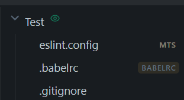

# Code Files — Obsidian Plugin

Open and edit code files directly in Obsidian using a full Monaco Editor (the same editor as VS Code), with syntax highlighting, folding, line numbers, minimap, and validation.

---

## Features

- **Full Monaco Editor** — VS Code's editor embedded locally in Obsidian, with syntax highlighting (80+ languages), folding, line numbers, minimap, and validation
- **50+ Themes** — Dracula, Monokai, Nord, Tomorrow Night, and more, with live preview in theme picker
- **Multi-Language Formatting** — Prettier (JS, TS, CSS, HTML, JSON, YAML, Markdown, GraphQL), Mermaid, Ruff (Python), gofmt (Go), clang-format (C/C++). Trigger: `Shift+Alt+F` or `formatOnSave`
- **Format Diff & Selective Revert** — view side-by-side diff after formatting; revert individual blocks or all changes with one click
- **Cross-File Navigation** — Ctrl+Click on TS/JS imports to jump to definitions. Requires Project Root Folder (right-click folder → Code Files → Define as Project Root). Project root highlighted in explorer (color customizable)
- **File Explorer Visual Indicators** — uppercase label on registered dotfiles (ENV, GITIGNORE), muted label on unregistered extensions, project root highlight
- **Built-In Hidden Files** — no external plugin needed. Auto-reveal registered dotfiles in explorer (configurable). Bulk reveal/hide via Reveal Hidden Files modal (folder context menu)
- **Dynamic Extension Management** — add/remove extensions at runtime. Quick actions via right-click in explorer: Register Extension / Unregister Extension
- **Two Extension Modes** — Manual (curated list) or Extended (all 80+ Monaco languages auto-registered). Exclusions and custom additions are preserved when switching modes
- **Create Code Files Modal** — interactive modal with extension autosuggest, supports dotfiles files (.env), auto-registers new extensions
- **Per-Extension & Global Config** — JSONC editor config (tabSize, insertSpaces, formatOnSave, printWidth, etc.) with global fallback and language-level inheritance
- **Editor Settings Modal** — inline Monaco JSON editor with live preview, accessible via ⚙️ gear icon in tab header
- **AutoSave (OFF by default)** — visual dirty indicator (circle in tab header); prevents accidental saves. Format on save optional
- **Code Block Editing** — open any code fence in full Monaco modal from editor context menu
- **Open Any File in Monaco** — command palette or right-click → "Open in Monaco Editor"
- **Popout Windows** — secondary windows support (Ctrl+Shift+Alt+Click)
- **Dynamic Hotkey Sync** — Monaco hotkeys automatically update when Obsidian hotkey settings change (no reload needed) and overridable in plugin settings

---

## Opening Files in Monaco

Files with registered extensions open automatically in Monaco, as well as dotfiles with a registered extension (e.g. .env) and extension-less files (e.g. LICENSE, README). You can also open any file manually:

- Command palette → **"Open current file in Monaco Editor"**
- Right-click a file → **"Open in Monaco Editor"**
- Right-click in the editor → **"Open in Monaco Editor"**

When opening a file with an unregistered extension in Monaco, a **return arrow icon** appears in the tab header to switch back to the default view.

---

## Creating a File & Managing Extensions

- Right-click a folder in the explorer → **Code Files → Create Code File | Manage extensions**
- Command palette → **"Create new Code File"**

A modal opens with a filename field and an extension field. The **±** button at the top lets you add or remove extensions independently of file creation — useful when you just want to manage extensions without creating a file.

To create a file, enter a name and pick or type an extension. If the extension doesn't exist yet, it is registered automatically. To create a dotfile (e.g. `.env`, `.gitignore`), leave the filename empty and enter only the extension.

---

## Document Formatting

Format your code with Monaco's built-in formatters:

- **Keyboard shortcut**: `Shift+Alt+F` (all supported languages)
- **Automatic**: Enable `formatOnSave` in Editor Config
- **Context menu**: Right-click → "📝 Format Document"

### Supported Languages

- **JavaScript** (parser: babel) — supports JSX
- **TypeScript** (parser: typescript) — supports TSX
- **CSS** (parser: css)
- **SCSS** (parser: scss)
- **Less** (parser: less)
- **HTML** (parser: html)
- **JSON** (parser: json)
- **YAML** (parser: yaml)
- **GraphQL** (parser: graphql)
- **Markdown** (parser: markdown) — with Mermaid block formatting
- **Mermaid** (mermaid-formatter) — standalone .mmd files
- **Python** (Ruff formatter) — PEP 8 compliant formatting
- **Go** (gofmt) — official Go formatter
- **C/C++** (clang-format) — LLVM's official formatter

### Format Diff Viewer

After formatting any file, you can view the changes:

- A **diff icon** appears in the tab header for 10 seconds
- Click it to open a side-by-side comparison (original vs formatted)
- Also available in the context menu: **"⟷ Show Format Diff"**
- **Selective Revert**: Use the ↩ button in the left gutter to revert specific blocks without undoing the entire document
- **Revert All**: Undoes all formatting changes instantly and closes the diff view

The diff viewer uses Monaco's native `createDiffEditor`, displaying changes with syntax highlighting, inline diff markers, and interactive widgets.

### Test Samples _(Developer/contributor only)_

The `templates/format-test-samples-for-obsidian/` folder contains example files with intentional formatting errors. **Copy this folder to your Obsidian vault** to try formatting on different file types.

---

## Cross-File Navigation (TypeScript/JavaScript)

Navigate between TypeScript and JavaScript files in your project:

- **Ctrl+Click** on imports, function calls, or class names to jump to their definitions
- **Go to Definition** (F12) shows a peek window with the definition location
- Works with relative imports (`./utils`, `../service`) and supports `.ts`, `.tsx`, `.js`, `.jsx` files
- **Smart tab reuse** — if the target file is already open, it reuses that tab instead of creating a new one

### Setup

**IMPORTANT:** Cross-file navigation requires configuring the Project Root Folder.

**Two ways to set the Project Root Folder:**

1. **Via context menu**:
    - Right-click any folder in the file explorer
    - Select **Code Files → Define as Project Root Folder**
    - The folder is highlighted (default purple/rose matching Obsidian's accent color) in the explorer
    - To clear: right-click the same folder → **Code Files → Clear Project Root Folder**

2. **Via Editor Settings**:
    - Open Editor Settings (⚙️ gear icon in tab header)
    - Set **Project Root Folder** to your TypeScript/JavaScript project folder

Monaco will load all TS/JS files from that folder for IntelliSense and navigation.

**Note:** Without a Project Root Folder, Ctrl+Click on imports will not work.

See `docs/cross-file-navigation.md` for implementation details. _(Developer only)_

---

## File Explorer Visual Indicators

Code Files adds visual cues in the Obsidian file explorer to help you identify which files will open in Monaco.



<small>Explorer indicators — folder "Test" (green eye icon = revealed); `eslint.config.mts` — yellow label (MTS extension visible via "Detect all file extensions" but NOT registered); `.gitignore` — no label (dotfile revealed but NOT registered with Code Files).</small>

### Project Root Folder Highlight

- **Default color**: Purple/rose (matches Obsidian's accent color; configurable)
- **How to set**: Right-click folder → **Code Files → Define as Project Root Folder**
- **Custom color**: Obsidian Settings → Code Files → Project Root Folder section

### File Badges

- **Unregistered extensions** (e.g. `eslint.config.mts`): muted yellow label to indicate the file won't open in Monaco.
- **Folder eye icon (👁️)**: appears only on folders with dotfiles **explicitly revealed** via the modal. Dotfiles auto-revealed via registered extensions do not trigger this icon.

---

## Hidden Files (Dotfiles)

Code Files handles dotfile management entirely — no external plugin needed.

### Automatic Setup

On startup, the plugin automatically enables Obsidian's **"Detect all file extensions"** setting. This is required for dotfiles to be visible and openable in Monaco. A one-time notice is shown when this happens.

### Auto-Reveal

When **Auto-reveal registered dotfiles** is enabled (default: on):

- Any dotfile whose extension is registered with Code Files is **automatically revealed** in the explorer
- Example: if `.env` extension is registered, all `.env` files become visible without any manual action
- Auto-revealed files are hidden automatically if the extension is unregistered or auto-reveal is disabled

### Reveal Hidden Files Modal

- **Right-click a folder** in the explorer → **Code Files → Reveal/Hide Hidden Files**
- The modal lists all hidden files in that folder **and its subfolders** with a **two-column layout**:
    - **Left column (Reveal)** — check to reveal in the explorer, uncheck to hide
    - **Right column (Register)** — check to register the file's extension with Code Files (opens automatically in Monaco)
- **Master checkboxes**: "All" in each column selects/deselects all items
- **Click Apply** to confirm all changes at once

### Manual vs Auto-Reveal

- **Manual reveal**: You explicitly check a file in the modal → persists until you uncheck it
- **Auto-reveal**: Extension registered → file automatically shown → hidden if extension is unregistered or auto-reveal is disabled

### Open Hidden Files with Temporary Reveal

You can open dotfiles in the vault directly in Monaco. Files are temporarily revealed in the vault index for editing, then automatically hidden when the tab is closed:

- Command palette → **"Open Hidden Files in Vault"**
- A suggester lists all hidden files with their relative paths

**Persistence**: Opened hidden files (including unregistered dotfiles and registered dotfiles) persist across Obsidian restarts.

### Behavior on Extension Changes

- **Registering an extension**: existing dotfiles with that extension are automatically revealed (if auto-reveal is on)
- **Unregistering an extension**: manually revealed files stay visible; auto-revealed files are hidden
- **Trash/deletion**: dotfiles can be deleted normally via Obsidian's context menu
- drag and drop works as expected

---

### Hidden Files Settings

In **Obsidian Settings → Code Files → Hidden Files**:

- **Auto-reveal registered dotfiles** — automatically reveal dotfiles whose extensions are registered
- **Excluded folders** — hidden folders to never show (e.g. `.git`, `node_modules`, `.trash`)
- **Excluded extensions** — hidden file extensions to ignore (e.g. `tmp`, `log`, `cache`)

### Filtered File Types

For safety, the following are excluded from scanning:

- Executables: `exe`, `dll`, `so`, `dylib`, `app`, `dmg`, `msi`
- Archives: `zip`, `rar`, `7z`, `tar`, `gz`, `bz2`, `xz`
- Databases: `db`, `sqlite`, `mdb`
- Binary Office formats: `doc`, `xls`, `ppt`
- Fonts: `ttf`, `otf`, `woff`, `woff2`, `eot`

---

## Opening External Files (.obsidian/)

You can open and edit any file in your `.obsidian/` folder directly in Monaco:

- Command palette → **"Browse External Files (.obsidian/)"**
- A suggester opens, listing all files in `.obsidian/` with their relative paths
- Files are filtered by size (max 10MB by default) and type (binaries excluded)
- Select a file to open it in a new Monaco tab

**Supported file types:** All text files except binaries (executables, archives, databases, fonts, etc.)

**Use cases:**
- Edit Obsidian config files: `app.json`, `workspace.json`, `hotkeys.json`
- Modify plugin data files: `.obsidian/plugins/*/data.json`
- Customize themes: `.obsidian/themes/*.css`
- Access any configuration file in your vault's `.obsidian/` folder

**Persistence:** Opened external files persist across Obsidian restarts, allowing multi-session editing.

---

## Renaming Files (name + extension)

- Click the **pencil icon** in the tab header
- Right-click a file in the explorer → **"Rename (Name/ext)"**
- Right-click the file in the editor → **"Rename (Name/ext)"**
- Command palette → **"Rename (Name/ext) of current file"**

Allows renaming both the filename and extension:

- Change extension: `myfile.py` → `myfile.js`
- Change name: `myfile.py` → `newname.py`
- Change both: `myfile.py` → `newfile.js`
- Create dotfiles: `.env` → `.prettierrc`
- Transform dotfiles to normal files: `.pythonconfig` → `config.yaml`

If the new extension is unknown, you'll be prompted to register it.

---

## Editing a Code Block

Place your cursor inside any code fence (` ```lang ... ``` `):

- Right-click → **"Edit Code Block in Monaco Editor"**
- Command palette → **"Open current code block in Monaco Editor"**

The block opens in a full-screen Monaco modal. Changes are written back when you close it.

---

## The Tab Header Bar

When a code file is open, icons appear in the tab header:

| Icon           | What it does                                                                                |
| -------------- | ------------------------------------------------------------------------------------------- |
| ✏️ **Pencil**  | Rename the file (name + extension). Unknown extensions will prompt for registration.        |
| 🎨 **Palette** | Pick a theme with live preview. Hover to preview, adjust brightness with left/right arrows. |
| ↩ **Arrow**    | Return to default view (only for files with unregistered extensions opened in Monaco).      |
| ⚙️ **Gear**    | Open the Editor Settings panel                                                              |

These actions are also available via **F1** or right-click inside Monaco.

### CSS Snippet Controls

When editing a CSS snippet file (`.obsidian/snippets/*.css`), two additional controls appear:

| Icon          | What it does                                                     |
| ------------- | ---------------------------------------------------------------- |
| 📁 **Folder** | Open the snippets folder in your system file explorer            |
| 🔘 **Toggle** | Enable or disable the current snippet without leaving the editor |

**Persistence**: Opened CSS snippets persist across Obsidian restarts, allowing multi-session editing.

---

## Editor Settings (gear icon)

### Toggles

- **Auto Save** — when off, only `Ctrl+S` saves. A circle in the tab shows unsaved state.
- **Semantic / Syntax Validation** — error checking for JS/TS
- **Editor Brightness** — dim or brighten Monaco independently of Obsidian's theme. Also adjustable via left/right arrow keys in the theme picker.
- **Project Root Folder** — set the root folder for TypeScript/JavaScript cross-file navigation

### Editor Config

JSON editor for formatting rules. Two scopes:

- **Global (`*`)** — applies to all file types
- **`.ext`** — overrides for the current extension only

```jsonc
{
	"tabSize": 4,
	"insertSpaces": true,
	"formatOnSave": true,
	"formatOnType": false,
	"printWidth": 80, // Line length for Prettier
	"proseWrap": "always" // Markdown only: "always" | "never" | "preserve"
	// "rulers": [80, 120],
	// "fontSize": 14,
}
```

**Language-Specific Templates:** When you open a per-extension config, the editor pre-fills with helpful suggestions:

- **JSON/YAML**: 2-space indentation (Prettier standard)
- **Python**: 4-space indentation (PEP 8)
- **Go**: tabs (gofmt standard)
- **C/C++**: 4-space indentation (clang-format default)
- **Other languages** (Rust, Java, C#, PHP): templates available, but no formatter is currently integrated — these are display settings only

**Config Cascade:** Extensions that map to a different Monaco language inherit that language's config automatically.

- `.clangformat` (maps to `yaml`) inherits YAML config (tabSize: 2)
- `.prettierrc` (maps to `json`) inherits JSON config (tabSize: 2)
- `.eslintrc`, `.babelrc` (map to `json`) inherit JSON config

Cascade order: `global (*) → language → extension`

**Note:** `printWidth` affects Prettier-based formatters. `proseWrap` is Markdown-specific. `rulers` adds visual line length guides in all languages.

Changes save automatically when the panel closes.

---

## Plugin Settings (Obsidian Settings → Code Files)

- **Use extended extensions list** — auto-register all Monaco-supported extensions (80+) vs. manual management
- **Manage extensions** — add or remove extensions; changes take effect immediately
- **Maximum file size** — maximum file size in MB for Monaco (default: 10 MB, range 1-100 MB)
- **Editor Config** — same JSON editor as the gear panel, with extension picker
- **Monaco Hotkey Overrides** — configure overrides for Command Palette (Ctrl+P), Settings (Ctrl+,), and Delete File (Ctrl+Delete). Changes require Monaco to reload.
- **Project Root Folder Highlight Color** — customize the color used to highlight the project root in the explorer

---

## Keyboard Shortcuts

| Shortcut      | Action                                                   |
| ------------- | -------------------------------------------------------- |
| `Ctrl+S`      | Save (formats first if formatOnSave is on)               |
| `Shift+Alt+F` | Format document                                          |
| `Ctrl+/`      | Toggle line comment                                      |
| `Alt+Z`       | Toggle word wrap                                         |
| `F1`          | Monaco command palette                                   |
| `Ctrl+P`      | Obsidian command palette (accessible from inside Monaco) |
| `Ctrl+,`      | Obsidian settings (accessible from inside Monaco)        |
| `Ctrl+Delete` | Delete the current file                                  |

---

## Managing Extensions

Extensions control which file types open in Monaco.

**Two modes:**

- **Manual** — maintain your own curated list
- **Extended** — all 80+ Monaco languages auto-registered. You can still exclude or add extras.

**Quick actions via file explorer context menu:**

- **Register Extension** — right-click any file with an unregistered extension → Code Files → Register Extension
- **Unregister Extension** — right-click any file with a registered custom extension → Code Files → Unregister Extension

Changes take effect immediately. Extensions can also be added on the fly from the **Create Code File** modal or **Rename (Name/ext)** dialog.

---

## Architecture Overview

| File                      | Role                                                                |
| ------------------------- | ------------------------------------------------------------------- |
| `mountCodeEditor.ts`      | Creates the Monaco iframe and handles all postMessage communication |
| `monacoEditor.html`       | The iframe HTML, loaded locally from the plugin folder              |
| `codeEditorView.ts`       | Obsidian TextFileView wrapping Monaco                               |
| `getLanguage.ts`          | Extension → Monaco language ID mapping                              |
| `fenceEditModal.ts`       | Modal for editing code fences                                       |
| `createCodeFileModal.ts`  | Modal for creating new code files                                   |
| `renameExtensionModal.ts` | Modal for renaming files (name + extension)                         |
| `editorSettingsModal.ts`  | Gear panel: toggles + JSON config editor                            |
| `chooseThemeModal.ts`     | Theme picker with live preview                                      |

---

## Package Size

**Current size: ~21.4 MB**

The plugin bundle includes:

- Monaco Editor: ~12 MB
- Themes: ~2 MB
- Formatters (Prettier, Mermaid, Ruff, gofmt, clang-format): ~5 MB
- Plugin code: ~1 MB
- Other assets and overhead: ~1.4 MB

The plugin is completely offline with no external dependencies.

---

## Development

```bash
git clone https://github.com/3C0D/obsidian-sample-plugin-modif.git
cd obsidian-sample-plugin-modif
yarn install
```

modify the `.env` file:

```env
TEST_VAULT=C:\path\to\test\vault
REAL_VAULT=C:\path\to\real\vault
```

```bash
yarn start    # Development with hot reload → TEST_VAULT
yarn build    # Production build (current folder)
yarn real     # Build + install to REAL_VAULT
```

See `docs/monaco-local-integration.md` for Monaco local loading details.
See `docs/prettier-markdown-formatting.md` for Prettier formatting implementation.
See `docs/mermaid-formatting.md` for Mermaid formatting implementation.
See `docs/cross-file-navigation.md` for cross-file navigation implementation.

### Adding New Formatters

**Integrated formatters**: Prettier (JS, TS, CSS, SCSS, Less, HTML, JSON, YAML, GraphQL, Markdown), Mermaid, Ruff (Python), gofmt (Go), clang-format (C/C++)

**No formatter yet**: Rust, Java, C#, PHP (syntax highlighting only)

**Integration Pattern** — all formatters follow the same pattern in `monacoEditor.html`:

1. Load formatter library as UMD bundle via `<script>` tag
2. Register with Monaco: `monaco.languages.registerDocumentFormattingEditProvider(languageId, provider)`
3. Provider implements `provideDocumentFormattingEdits()` which returns text edits

**Potential Formatters:**

- **Rust**: rustfmt (WASM build needed)
- **Java**: google-java-format (WASM build needed)
- **C#**: csharpier (WASM build needed)
- **PHP**: PHP-CS-Fixer (WASM build needed)
- **Multi-language**: [Biome](https://biomejs.dev/) (JS, TS, JSON, JSX/TSX via WASM)

**Key Files for Integration:** `monacoEditor.html`, `mountCodeEditor.ts`, `types.ts`, `README.md`
