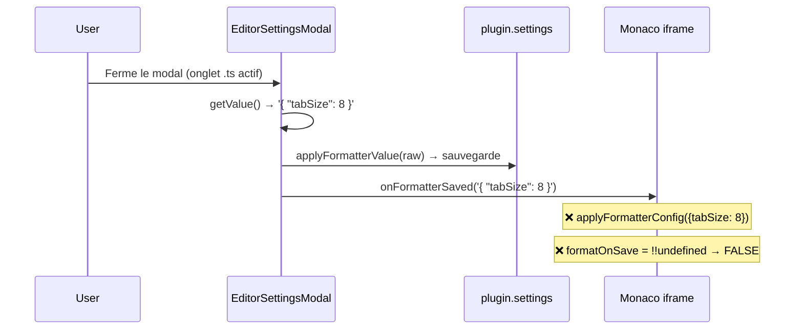

# Fix `formatOnSave` — Analyse du bug et corrections

## 🐛 Le bug

`Ctrl+S` ne déclenche pas le formatage sauf si `"formatOnSave": true` est présent **à la fois** dans la config globale (`*`) **et** dans la config par extension (`.ts`).

## 🔍 Cause racine

Le problème se trouve dans [editorSettingsModal.ts](file:///c:/Users/dd200/Documents/Mes_projets/Mes%20repo%20obsidian%20new/obsidian-code-files-modif/src/modals/editorSettingsModal.ts), méthode `onClose()`.

### Flux problématique (avant fix)



Le callback `onFormatterSaved` envoyait la config **brute** de l'extension (ex: `{ "tabSize": 8 }`) directement à l'iframe Monaco, **sans la fusionner** avec la config globale (`*`). Résultat : `formatOnSave` (défini dans la config globale) n'était pas dans l'objet reçu → `!!undefined` → `false`.

### Pourquoi le formatage via le menu marchait ?

Le `formatOnSave` n'intervient que dans le handler `Ctrl+S` côté iframe. Le menu contextuel « Format Document » appelle directement `editor.action.formatDocument` sans vérifier `formatOnSave`.

### Confirmation dans les données persistées

```json
// data.json — pas de clé '*' !
"editorConfigs": {
    "ts": "{...\"tabSize\": 8...}"
}
```

La clé `'*'` avait été **supprimée** par `applyFormatterValue` quand la config globale était identique au default.

## ✅ Corrections appliquées

### 1. Centralisation du merge dans `buildMergedConfig`

```diff:settingsUtils.ts
import type CodeFilesPlugin from '../main.ts';
import { DEFAULT_SETTINGS, DEFAULT_EDITOR_CONFIG } from '../types.ts';

/**
 * Merges persisted data on top of DEFAULT_SETTINGS.
 * `editorConfigs` needs a manual deep merge: a plain spread would overwrite the entire object,
 * losing `DEFAULT_EDITOR_CONFIG['*']` if the saved data has no `'*'` key.
 */
export async function loadSettings(plugin: CodeFilesPlugin): Promise<void> {
	const loaded = await plugin.loadData();
	plugin.settings = {
		...DEFAULT_SETTINGS,
		...loaded,
		editorConfigs: {
			'*': DEFAULT_EDITOR_CONFIG,
			...(loaded?.editorConfigs ?? {})
		}
	};
	if (!plugin.settings.extraExtensions) {
		plugin.settings.extraExtensions = [];
	}
}

export async function saveSettings(plugin: CodeFilesPlugin): Promise<void> {
	await plugin.saveData(plugin.settings);
}
===
import type CodeFilesPlugin from '../main.ts';
import {
	DEFAULT_SETTINGS,
	DEFAULT_EDITOR_CONFIG,
	parseEditorConfig
} from '../types.ts';

/**
 * Merges persisted data on top of DEFAULT_SETTINGS.
 * `editorConfigs` needs a manual deep merge:
 * a plain spread would overwrite the entire object,
 * losing `DEFAULT_EDITOR_CONFIG['*']` if the saved
 * data has no `'*'` key.
 */
export async function loadSettings(
	plugin: CodeFilesPlugin
): Promise<void> {
	const loaded = await plugin.loadData();
	plugin.settings = {
		...DEFAULT_SETTINGS,
		...loaded,
		editorConfigs: {
			'*': DEFAULT_EDITOR_CONFIG,
			...(loaded?.editorConfigs ?? {})
		}
	};
	if (!plugin.settings.extraExtensions) {
		plugin.settings.extraExtensions = [];
	}
}

export async function saveSettings(
	plugin: CodeFilesPlugin
): Promise<void> {
	await plugin.saveData(plugin.settings);
}

/**
 * Returns the merged editor config (global `*`
 * + per-extension override) as a JSON string.
 *
 * This is the single source of truth for the
 * cascade: default → global → extension.
 */
export function buildMergedConfig(
	plugin: CodeFilesPlugin,
	ext: string
): string {
	const globalCfg = parseEditorConfig(
		plugin.settings.editorConfigs['*']
			?? DEFAULT_EDITOR_CONFIG
	) as Record<string, unknown>;
	const extCfg = ext
		? (parseEditorConfig(
				plugin.settings.editorConfigs[ext]
					?? '{}'
			) as Record<string, unknown>)
		: {};
	return JSON.stringify({ ...globalCfg, ...extCfg });
}
```

Nouvelle fonction `buildMergedConfig(plugin, ext)` — point unique pour le merge `global + extension`.

### 2. Fix du `onClose` dans le modal

```diff:editorSettingsModal.ts
import { ButtonComponent, Modal, Setting, debounce } from 'obsidian';
import type CodeFilesPlugin from '../main.ts';
import {
	DEFAULT_EDITOR_CONFIG,
	DEFAULT_EXTENSION_CONFIG,
	parseEditorConfig
} from '../types.ts';
import type { CodeEditorInstance } from '../types.ts';
import { mountCodeEditor } from '../editor/mountCodeEditor.ts';
import { getCodeEditorViews } from '../utils/extensionUtils.ts';

/** Unified editor settings modal — toggles for global editor options + Monaco JSON editor for formatter config.
 *  Opened via the gear icon in the tab header of code-editor views. */
export class EditorSettingsModal extends Modal {
	private codeEditor!: CodeEditorInstance;
	private isGlobal = false;

	constructor(
		private plugin: CodeFilesPlugin,
		private extension: string,
		private onSettingsChanged: () => void,
		private onFormatterSaved: (config: string) => void
	) {
		super(plugin.app);
	}

	private applyFormatterValue(value: string): boolean {
		const key = this.isGlobal ? '*' : this.extension;
		const defaultForKey = this.isGlobal
			? DEFAULT_EDITOR_CONFIG
			: DEFAULT_EXTENSION_CONFIG;
		try {
			parseEditorConfig(value);
			if (value === defaultForKey.trim()) {
				delete this.plugin.settings.editorConfigs[key];
			} else {
				this.plugin.settings.editorConfigs[key] = value;
			}
			return true;
		} catch {
			return false;
		}
	}

	async onOpen(): Promise<void> {
		super.onOpen();
		setTimeout(() => {
			const bg = document.querySelector<HTMLElement>('.modal-bg');
			if (bg) bg.style.opacity = '0';
		}, 0);
		this.titleEl.setText('Editor Settings');
		this.modalEl.style.width = '560px';
		this.modalEl.style.height = '700px';
		this.modalEl.style.position = 'fixed';
		setTimeout(() => {
			const { innerWidth } = window;
			const { offsetWidth } = this.modalEl;
			const desiredLeft = innerWidth * 0.65;
			if (desiredLeft + offsetWidth / 2 > innerWidth - 10) {
				this.modalEl.style.left = '50%';
			} else {
				this.modalEl.style.left = '65%';
			}
			this.modalEl.style.top = '10%';
			this.modalEl.style.transform = 'translateX(-50%)';
		}, 0);

		const { contentEl } = this;
		contentEl.style.display = 'flex';
		contentEl.style.flexDirection = 'column';

		// ── Toggles ──────────────────────────────────────────────────────────
		const toggleSection = contentEl.createEl('div', {
			cls: 'code-files-settings-toggles'
		});

		new Setting(toggleSection)
			.setName('Auto Save')
			.setDesc('(Ctrl+S) to save when Off')
			.addToggle((t) =>
				t.setValue(this.plugin.settings.autoSave).onChange(async (v) => {
					this.plugin.settings.autoSave = v;
					await this.plugin.saveSettings();
					if (v) {
						for (const view of getCodeEditorViews(this.app)) {
							view.requestSave();
							view.clearDirty();
						}
					}
					this.onSettingsChanged();
				})
			);

		new Setting(toggleSection)
			.setName('Semantic Validation')
			.setDesc('Type errors for JS/TS.')
			.addToggle((t) =>
				t
					.setValue(this.plugin.settings.semanticValidation)
					.onChange(async (v) => {
						this.plugin.settings.semanticValidation = v;
						await this.plugin.saveSettings();
						this.onSettingsChanged();
					})
			);

		new Setting(toggleSection)
			.setName('Syntax Validation')
			.setDesc('Syntax errors for JS/TS.')
			.addToggle((t) =>
				t.setValue(this.plugin.settings.syntaxValidation).onChange(async (v) => {
					this.plugin.settings.syntaxValidation = v;
					await this.plugin.saveSettings();
					this.onSettingsChanged();
				})
			);

		new Setting(toggleSection)
			.setName('Editor Brightness')
			.setDesc('Adjust Monaco editor brightness (0.2 – 2.0)')
			.addSlider((s) =>
				s
					.setLimits(0.2, 2, 0.1)
					.setValue(this.plugin.settings.editorBrightness)
					.setDynamicTooltip()
					.onChange(async (v) => {
						this.plugin.settings.editorBrightness = v;
						await this.plugin.saveSettings();
						this.plugin.broadcastBrightness();
					})
			);

		// ── Formatter Config ──────────────────────────────────────────────────
		const formatterSection = contentEl.createEl('div', {
			cls: 'code-files-editor-config-section'
		});
		formatterSection.style.marginTop = '1rem';
		formatterSection.style.flex = '1';
		formatterSection.style.display = 'flex';
		formatterSection.style.flexDirection = 'column';

		formatterSection.createEl('hr', {
			attr: {
				style: 'margin: 0 0 0.5rem 0; border: none; border-top: 1px solid var(--background-modifier-border);'
			}
		});

		const scopeRow = formatterSection.createEl('div', {
			attr: { style: 'display: flex; gap: 8px; margin-bottom: 6px;' }
		});
		const btnGlobal = new ButtonComponent(scopeRow).setButtonText('Global (*)');
		const btnExt = new ButtonComponent(scopeRow).setButtonText(`.${this.extension}`);

		const configTitle = formatterSection.createEl('div', {
			text: `Editor Config — .${this.extension}`,
			cls: 'code-files-editor-config-title'
		});

		const switchScope = (global: boolean): void => {
			this.isGlobal = global;
			if (global) {
				btnGlobal.setCta();
				btnExt.buttonEl.removeClass('mod-cta');
				configTitle.setText('Editor Config — *');
			} else {
				btnExt.setCta();
				btnGlobal.buttonEl.removeClass('mod-cta');
				configTitle.setText(`Editor Config — .${this.extension}`);
			}
			const cfg =
				this.plugin.settings.editorConfigs?.[global ? '*' : this.extension];
			if (this.codeEditor)
				this.codeEditor.setValue(
					cfg ?? (global ? DEFAULT_EDITOR_CONFIG : DEFAULT_EXTENSION_CONFIG)
				);
		};

		btnGlobal.onClick(() => switchScope(true));
		btnExt.onClick(() => switchScope(false));
		switchScope(false);

		const editorContainer = formatterSection.createEl('div', {
			cls: 'code-files-editor-config-editor'
		});
		editorContainer.style.border = '1px solid var(--background-modifier-border)';
		editorContainer.style.marginTop = '8px';
		editorContainer.style.borderRadius = '4px';
		editorContainer.style.overflow = 'hidden';
		editorContainer.style.flex = '1';

		const existing = this.plugin.settings.editorConfigs[this.extension];
		const initialValue = existing ?? DEFAULT_EXTENSION_CONFIG;

		const debouncedSave = debounce(
			async () => {
				if (!this.codeEditor) return;
				const value = this.codeEditor.getValue().trim();
				if (this.applyFormatterValue(value)) {
					await this.plugin.saveSettings();
					this.plugin.broadcastEditorConfig(
						this.isGlobal ? '*' : this.extension
					);
				}
			},
			600,
			true
		);

		this.codeEditor = await mountCodeEditor(
			this.plugin,
			'json',
			initialValue,
			`editor-settings-config.jsonc`,
			() => debouncedSave()
		);
		editorContainer.append(this.codeEditor.iframe);

		// Save button removed - config is saved on close
	}

	onClose(): void {
		super.onClose();
		const bg = document.querySelector<HTMLElement>('.modal-bg');
		if (bg) bg.style.opacity = '';
		if (this.codeEditor) {
			const value = this.codeEditor.getValue().trim();
			if (this.applyFormatterValue(value)) {
				void this.plugin.saveSettings();
				this.onFormatterSaved(value);
			}
			this.codeEditor.destroy();
		}
		this.contentEl.empty();
	}
}
===
import { ButtonComponent, Modal, Setting, debounce } from 'obsidian';
import type CodeFilesPlugin from '../main.ts';
import {
	DEFAULT_EDITOR_CONFIG,
	DEFAULT_EXTENSION_CONFIG,
	parseEditorConfig
} from '../types.ts';
import type { CodeEditorInstance } from '../types.ts';
import { mountCodeEditor } from '../editor/mountCodeEditor.ts';
import { getCodeEditorViews } from '../utils/extensionUtils.ts';
import { buildMergedConfig } from '../utils/settingsUtils.ts';

/** Unified editor settings modal — toggles for global editor options + Monaco JSON editor for formatter config.
 *  Opened via the gear icon in the tab header of code-editor views. */
export class EditorSettingsModal extends Modal {
	private codeEditor!: CodeEditorInstance;
	private isGlobal = false;

	constructor(
		private plugin: CodeFilesPlugin,
		private extension: string,
		private onSettingsChanged: () => void,
		private onFormatterSaved: (config: string) => void
	) {
		super(plugin.app);
	}

	private applyFormatterValue(value: string): boolean {
		const key = this.isGlobal ? '*' : this.extension;
		const defaultForKey = this.isGlobal
			? DEFAULT_EDITOR_CONFIG
			: DEFAULT_EXTENSION_CONFIG;
		try {
			parseEditorConfig(value);
			if (
				key !== '*' &&
				value === defaultForKey.trim()
			) {
				// Only delete overrides, never
				// the global '*' key.
				delete this.plugin.settings
					.editorConfigs[key];
			} else {
				this.plugin.settings
					.editorConfigs[key] = value;
			}
			return true;
		} catch {
			return false;
		}
	}

	async onOpen(): Promise<void> {
		super.onOpen();
		setTimeout(() => {
			const bg = document.querySelector<HTMLElement>('.modal-bg');
			if (bg) bg.style.opacity = '0';
		}, 0);
		this.titleEl.setText('Editor Settings');
		this.modalEl.style.width = '560px';
		this.modalEl.style.height = '700px';
		this.modalEl.style.position = 'fixed';
		setTimeout(() => {
			const { innerWidth } = window;
			const { offsetWidth } = this.modalEl;
			const desiredLeft = innerWidth * 0.65;
			if (desiredLeft + offsetWidth / 2 > innerWidth - 10) {
				this.modalEl.style.left = '50%';
			} else {
				this.modalEl.style.left = '65%';
			}
			this.modalEl.style.top = '10%';
			this.modalEl.style.transform = 'translateX(-50%)';
		}, 0);

		const { contentEl } = this;
		contentEl.style.display = 'flex';
		contentEl.style.flexDirection = 'column';

		// ── Toggles ──────────────────────────────────────────────────────────
		const toggleSection = contentEl.createEl('div', {
			cls: 'code-files-settings-toggles'
		});

		new Setting(toggleSection)
			.setName('Auto Save')
			.setDesc('(Ctrl+S) to save when Off')
			.addToggle((t) =>
				t.setValue(this.plugin.settings.autoSave).onChange(async (v) => {
					this.plugin.settings.autoSave = v;
					await this.plugin.saveSettings();
					if (v) {
						for (const view of getCodeEditorViews(this.app)) {
							view.requestSave();
							view.clearDirty();
						}
					}
					this.onSettingsChanged();
				})
			);

		new Setting(toggleSection)
			.setName('Semantic Validation')
			.setDesc('Type errors for JS/TS.')
			.addToggle((t) =>
				t
					.setValue(this.plugin.settings.semanticValidation)
					.onChange(async (v) => {
						this.plugin.settings.semanticValidation = v;
						await this.plugin.saveSettings();
						this.onSettingsChanged();
					})
			);

		new Setting(toggleSection)
			.setName('Syntax Validation')
			.setDesc('Syntax errors for JS/TS.')
			.addToggle((t) =>
				t.setValue(this.plugin.settings.syntaxValidation).onChange(async (v) => {
					this.plugin.settings.syntaxValidation = v;
					await this.plugin.saveSettings();
					this.onSettingsChanged();
				})
			);

		new Setting(toggleSection)
			.setName('Editor Brightness')
			.setDesc('Adjust Monaco editor brightness (0.2 – 2.0)')
			.addSlider((s) =>
				s
					.setLimits(0.2, 2, 0.1)
					.setValue(this.plugin.settings.editorBrightness)
					.setDynamicTooltip()
					.onChange(async (v) => {
						this.plugin.settings.editorBrightness = v;
						await this.plugin.saveSettings();
						this.plugin.broadcastBrightness();
					})
			);

		// ── Formatter Config ──────────────────────────────────────────────────
		const formatterSection = contentEl.createEl('div', {
			cls: 'code-files-editor-config-section'
		});
		formatterSection.style.marginTop = '1rem';
		formatterSection.style.flex = '1';
		formatterSection.style.display = 'flex';
		formatterSection.style.flexDirection = 'column';

		formatterSection.createEl('hr', {
			attr: {
				style: 'margin: 0 0 0.5rem 0; border: none; border-top: 1px solid var(--background-modifier-border);'
			}
		});

		const scopeRow = formatterSection.createEl('div', {
			attr: { style: 'display: flex; gap: 8px; margin-bottom: 6px;' }
		});
		const btnGlobal = new ButtonComponent(scopeRow).setButtonText('Global (*)');
		const btnExt = new ButtonComponent(scopeRow).setButtonText(`.${this.extension}`);

		const configTitle = formatterSection.createEl('div', {
			text: `Editor Config — .${this.extension}`,
			cls: 'code-files-editor-config-title'
		});

		const switchScope = (global: boolean): void => {
			this.isGlobal = global;
			if (global) {
				btnGlobal.setCta();
				btnExt.buttonEl.removeClass('mod-cta');
				configTitle.setText('Editor Config — *');
			} else {
				btnExt.setCta();
				btnGlobal.buttonEl.removeClass('mod-cta');
				configTitle.setText(`Editor Config — .${this.extension}`);
			}
			const cfg =
				this.plugin.settings.editorConfigs?.[global ? '*' : this.extension];
			if (this.codeEditor)
				this.codeEditor.setValue(
					cfg ?? (global ? DEFAULT_EDITOR_CONFIG : DEFAULT_EXTENSION_CONFIG)
				);
		};

		btnGlobal.onClick(() => switchScope(true));
		btnExt.onClick(() => switchScope(false));
		switchScope(false);

		const editorContainer = formatterSection.createEl('div', {
			cls: 'code-files-editor-config-editor'
		});
		editorContainer.style.border = '1px solid var(--background-modifier-border)';
		editorContainer.style.marginTop = '8px';
		editorContainer.style.borderRadius = '4px';
		editorContainer.style.overflow = 'hidden';
		editorContainer.style.flex = '1';

		const existing = this.plugin.settings.editorConfigs[this.extension];
		const initialValue = existing ?? DEFAULT_EXTENSION_CONFIG;

		const debouncedSave = debounce(
			async () => {
				if (!this.codeEditor) return;
				const value = this.codeEditor.getValue().trim();
				if (this.applyFormatterValue(value)) {
					await this.plugin.saveSettings();
					this.plugin.broadcastEditorConfig(
						this.isGlobal ? '*' : this.extension
					);
				}
			},
			600,
			true
		);

		this.codeEditor = await mountCodeEditor(
			this.plugin,
			'json',
			initialValue,
			`editor-settings-config.jsonc`,
			() => debouncedSave()
		);
		editorContainer.append(this.codeEditor.iframe);

		// Save button removed - config is saved on close
	}

	onClose(): void {
		super.onClose();
		const bg = document.querySelector<HTMLElement>(
			'.modal-bg'
		);
		if (bg) bg.style.opacity = '';
		if (this.codeEditor) {
			const raw = this.codeEditor
				.getValue()
				.trim();
			if (this.applyFormatterValue(raw)) {
				void this.plugin.saveSettings();
				// Send the MERGED config
				// (global + ext) so the iframe
				// keeps inherited settings like
				// formatOnSave.
				this.onFormatterSaved(
					buildMergedConfig(
						this.plugin,
						this.extension
					)
				);
			}
			this.codeEditor.destroy();
		}
		this.contentEl.empty();
	}
}
```

Deux changements clés :
- **`onClose`** : envoie désormais `buildMergedConfig(plugin, ext)` au lieu de la config brute
- **`applyFormatterValue`** : ne `delete` jamais la clé `'*'` (protège la config globale)

### 3. Refactoring des call sites

```diff:broadcast.ts
import type CodeFilesPlugin from '../main.ts';
import { DEFAULT_EDITOR_CONFIG, parseEditorConfig } from '../types.ts';
import { getCodeEditorViews } from './extensionUtils.ts';

/**
 * Sends updated validation options to all open Monaco iframes.
 * Called after toggling semantic/syntax validation in settings — the iframes
 * are independent JS contexts and don't share state, so each must be notified individually.
 */
export function broadcastOptions(plugin: CodeFilesPlugin): void {
	for (const view of getCodeEditorViews(plugin.app)) {
		view.codeEditor?.send('change-options', {
			noSemanticValidation: !plugin.settings.semanticValidation,
			noSyntaxValidation: !plugin.settings.syntaxValidation
		});
	}
}

/**
 * Applies a CSS brightness filter directly on each iframe element.
 * Monaco runs in an isolated iframe so Obsidian's theme variables don't reach it —
 * a CSS filter on the iframe itself is the only way to dim/brighten the editor.
 */
export function broadcastBrightness(plugin: CodeFilesPlugin): void {
	for (const view of getCodeEditorViews(plugin.app)) {
		if (view.codeEditor?.iframe) {
			view.codeEditor.iframe.style.filter = `brightness(${plugin.settings.editorBrightness})`;
		}
	}
}

/**
 * Sends the merged editor config (global `'*'` + per-extension override) to open iframes.
 * When `ext` is `'*'`, all open views are updated because a global change affects every extension.
 * Otherwise only views whose file extension matches are targeted.
 * The per-extension config is spread on top of the global one, so only differing keys need to be set.
 */
export function broadcastEditorConfig(plugin: CodeFilesPlugin, ext: string): void {
	const globalCfg = parseEditorConfig(
		plugin.settings.editorConfigs['*'] ?? DEFAULT_EDITOR_CONFIG
	) as Record<string, unknown>;
	const views = getCodeEditorViews(plugin.app);
	const targets = ext === '*' ? views : views.filter((v) => v.file?.extension === ext);
	for (const view of targets) {
		const fileExt = view.file?.extension ?? '';
		const extCfg = parseEditorConfig(
			plugin.settings.editorConfigs[fileExt] ?? '{}'
		) as Record<string, unknown>;
		const config = JSON.stringify({ ...globalCfg, ...extCfg });
		view.codeEditor?.send('change-editor-config', { config });
	}
}
===
import type CodeFilesPlugin from '../main.ts';
import { getCodeEditorViews } from './extensionUtils.ts';
import { buildMergedConfig } from './settingsUtils.ts';

/**
 * Sends updated validation options to all open
 * Monaco iframes.
 * Called after toggling semantic/syntax validation
 * in settings — the iframes are independent JS
 * contexts and don't share state, so each must
 * be notified individually.
 */
export function broadcastOptions(
	plugin: CodeFilesPlugin
): void {
	for (const view of getCodeEditorViews(plugin.app)) {
		view.codeEditor?.send('change-options', {
			noSemanticValidation:
				!plugin.settings.semanticValidation,
			noSyntaxValidation:
				!plugin.settings.syntaxValidation
		});
	}
}

/**
 * Applies a CSS brightness filter on each iframe.
 * Monaco runs in an isolated iframe so Obsidian's
 * theme variables don't reach it — a CSS filter
 * on the iframe itself is the only way to
 * dim/brighten the editor.
 */
export function broadcastBrightness(
	plugin: CodeFilesPlugin
): void {
	for (const view of getCodeEditorViews(plugin.app)) {
		if (view.codeEditor?.iframe) {
			view.codeEditor.iframe.style.filter =
				`brightness(${plugin.settings.editorBrightness})`;
		}
	}
}

/**
 * Sends the merged editor config (global `'*'`
 * + per-extension override) to open iframes.
 * When `ext` is `'*'`, all open views are updated
 * because a global change affects every extension.
 * Otherwise only views whose file extension matches
 * are targeted.
 */
export function broadcastEditorConfig(
	plugin: CodeFilesPlugin,
	ext: string
): void {
	const views = getCodeEditorViews(plugin.app);
	const targets = ext === '*'
		? views
		: views.filter(
				(v) => v.file?.extension === ext
			);
	for (const view of targets) {
		const fileExt = view.file?.extension ?? '';
		const config = buildMergedConfig(
			plugin,
			fileExt
		);
		view.codeEditor?.send(
			'change-editor-config',
			{ config }
		);
	}
}

```

```diff:mountCodeEditor.ts
import type { TFile } from 'obsidian';
import type CodeFilesPlugin from '../main.ts';
import type { CodeEditorInstance } from '../types.ts';
import { DEFAULT_EDITOR_CONFIG, parseEditorConfig } from '../types.ts';
import manifest from '../../manifest.json' with { type: 'json' };
import { registerAndPersistLanguages } from '../utils/getLanguage.ts';
import { ChooseThemeModal } from '../modals/chooseThemeModal.ts';
import { RenameExtensionModal } from '../modals/renameExtensionModal.ts';
import { EditorSettingsModal } from '../modals/editorSettingsModal.ts';

/** Creates a Monaco Editor instance inside an iframe, communicating with it via postMessage.
 *  Returns a control object to get/set the editor value and manage its lifecycle.
 *
 *  Why an iframe?
 *  Monaco requires a full browser environment and conflicts with Obsidian's DOM if loaded directly.
 *  An iframe provides isolation while postMessage handles bidirectional communication.
 *
 *  Why async + fetch + blob URL?
 *  - getResourcePath() returns an app:// URL with a cache-busting timestamp (?1234...).
 *    This timestamp breaks relative paths like ./vs/loader.js inside the HTML.
 *  - file:// URLs are blocked by Electron.
 *  - Solution: fetch the HTML, patch the ./vs paths to absolute app:// URLs (timestamp stripped),
 *    inline the Monaco CSS (Obsidian's CSP blocks external <link> stylesheets in child frames),
 *    then inject via a blob URL which is not subject to the parent CSP for its own inline content.
 */
export const resolveThemeParams = async (
	plugin: CodeFilesPlugin,
	theme: string
): Promise<{ theme: string; themeData?: string }> => {
	const builtins = ['vs', 'vs-dark', 'hc-black', 'hc-light', 'default'];
	const pluginBase = `${plugin.app.vault.configDir}/plugins/${manifest.id}`;
	const resolvedTheme =
		theme === 'default'
			? document.body.classList.contains('theme-dark')
				? 'vs-dark'
				: 'vs'
			: theme;
	const safeThemeId = resolvedTheme.replace(/[^a-z0-9\-]/gi, '-');
	let themeData: string | undefined;
	if (!builtins.includes(theme)) {
		try {
			const url = plugin.app.vault.adapter
				.getResourcePath(`${pluginBase}/monaco-themes/${theme}.json`)
				.replace(/\?.*$/, '');
			themeData = JSON.stringify(await (await fetch(url)).json());
		} catch (e) {
			console.warn(`code-files: theme "${theme}" not found`, e);
		}
	}
	return { theme: safeThemeId, themeData };
};

export const mountCodeEditor = async (
	plugin: CodeFilesPlugin,
	language: string,
	initialValue: string,
	codeContext: string,
	onChange?: () => void,
	onSave?: () => void
): Promise<CodeEditorInstance> => {
	let value = initialValue;
	// Determine default theme: 'vs-dark' if Obsidian is in dark mode, 'vs' otherwise
	const defaultTheme = document.body.classList.contains('theme-dark')
		? 'vs-dark'
		: 'vs';
	const theme =
		plugin.settings.theme === 'default' ? defaultTheme : plugin.settings.theme;

	const pluginBase = `${plugin.app.vault.configDir}/plugins/${manifest.id}`;

	const initParams: Record<string, string | boolean> = {
		context: codeContext,
		lang: language,
		theme: theme.replace(/[^a-z0-9\-]/gi, '-'),
		wordWrap: plugin.settings.wordWrap,
		folding: plugin.settings.folding,
		lineNumbers: plugin.settings.lineNumbers,
		minimap: plugin.settings.minimap,
		noSemanticValidation: !plugin.settings.semanticValidation,
		noSyntaxValidation: !plugin.settings.syntaxValidation
	};
	if (!['vs', 'vs-dark', 'hc-black', 'hc-light', 'default'].includes(theme)) {
		const resolved = await resolveThemeParams(plugin, theme);
		if (resolved.themeData) initParams.themeData = resolved.themeData;
	}

	if (plugin.settings.theme === 'default') {
		initParams.background = 'transparent';
	}
	const extMatch = codeContext.match(/\.([^.]+)$/);
	const extension = extMatch ? extMatch[1] : '';
	const globalCfg = parseEditorConfig(
		plugin.settings.editorConfigs?.['*'] ?? DEFAULT_EDITOR_CONFIG
	) as Record<string, unknown>;
	const extCfg = extension
		? (parseEditorConfig(
				plugin.settings.editorConfigs?.[extension] ?? '{}'
			) as Record<string, unknown>)
		: {};
	initParams.formatterConfig = JSON.stringify({ ...globalCfg, ...extCfg });

	const iframe: HTMLIFrameElement = document.createElement('iframe');
	iframe.style.width = '100%';
	iframe.style.height = '100%';
	iframe.style.filter = `brightness(${plugin.settings.editorBrightness})`;

	// getResourcePath returns app://...?timestamp — the timestamp must be stripped
	// before using the URL as a base for relative paths inside the HTML
	const htmlUrl = plugin.app.vault.adapter.getResourcePath(
		`${pluginBase}/monacoEditor.html`
	);
	const vsBase = plugin.app.vault.adapter
		.getResourcePath(`${pluginBase}/vs`)
		.replace(/\?.*$/, '');

	let html = await (await fetch(htmlUrl)).text();
	// Patch relative ./vs paths to absolute app:// URLs so Monaco can load its workers and modules
	html = html
		.replace("'./vs'", `'${vsBase}'`)
		.replace('"./vs/loader.js"', `"${vsBase}/loader.js"`);

	const cssUrl = `${vsBase}/editor/editor.main.css`;
	let cssText = await (await fetch(cssUrl)).text();
	// Replace the base64-encoded font source in @font-face with an absolute app:// URL.
	// Obsidian's CSP blocks data: font sources in child frames, but app:// URLs are allowed.
	const codiconFontUrl = `${vsBase}/editor/codicon.ttf`;
	cssText = cssText.replace(
		/(@font-face\s*\{[^}]*src:[^;]*)(url\([^)]+\)\s*format\(["']truetype["']\))/g,
		`$1url('${codiconFontUrl}') format('truetype')`
	);
	// Inject CSS inline and intercept dynamic <link> insertions Monaco attempts at runtime.
	// Without this, Monaco tries to inject a <link rel="stylesheet"> which the parent CSP blocks.
	html = html.replace(
		'</head>',
		`<script>
function parseEditorConfig(str) {
    return JSON.parse(
        str
            .replace(/\\/\\/[^\\n]*/g, '')
            .replace(/\\/\\*[\\s\\S]*?\\*\\//g, '')
            .replace(/,(\\s*[}\\]])/g, '$1')
    );
}
</script>
<style>${cssText}</style>
<script>
const _orig = Element.prototype.appendChild;
Element.prototype.appendChild = function(node) {
    if (node.tagName === 'LINK' && node.rel === 'stylesheet') return node;
    return _orig.call(this, node);
};
</script>
</head>`
	);
	const blob = new Blob([html], { type: 'text/html' });
	const blobUrl = URL.createObjectURL(blob);
	iframe.src = blobUrl;

	const send = (type: string, payload: Record<string, unknown>): void => {
		iframe.contentWindow?.postMessage({ type, ...payload }, '*');
	};

	const onMessage = async ({ data, source }: MessageEvent): Promise<void> => {
		// Reject messages not originating from this specific iframe — guards against
		// other Monaco instances or third-party postMessage calls hitting this handler.
		if (source !== iframe.contentWindow) return;
		switch (data.type) {
			case 'ready': {
				// Monaco is loaded — send config, request language map, then set initial content.
				// Order matters: init must come before change-value so the editor exists when value arrives.
				send('init', initParams);
				send('get-languages', {});
				send('change-value', { value });
				break;
			}
			case 'languages': {
				// Received the full Monaco language→extension map.
				// registerAndPersistLanguages is a no-op after the first call (guards on dynamicMap.size).
				await registerAndPersistLanguages(data.langs, plugin);
				break;
			}
			case 'open-formatter-config': {
				if (data.context === codeContext) {
					(document.activeElement as HTMLElement)?.blur();
					const ext = codeContext.match(/\.([^./\\]+)$/)?.[1] ?? '';
					const modal = new EditorSettingsModal(
						plugin,
						ext,
						() => plugin.broadcastOptions(),
						(config) => {
							send('change-editor-config', { config });
						}
					);
					const origOnClose = modal.onClose.bind(modal);
					modal.onClose = () => {
						origOnClose();
						iframe.focus();
					};
					modal.open();
				}
				break;
			}
			case 'open-theme-picker': {
				if (data.context === codeContext) {
					(document.activeElement as HTMLElement)?.blur();
					const applyTheme = async (t: string): Promise<void> => {
						const params = await resolveThemeParams(plugin, t);
						send('change-theme', params);
					};
					const modal = new ChooseThemeModal(plugin, applyTheme, applyTheme);
					const origOnClose = modal.onClose.bind(modal);
					modal.onClose = () => {
						origOnClose();
						iframe.focus();
					};
					modal.open();
				}
				break;
			}
			case 'open-settings': {
				if (data.context === codeContext) {
					(document.activeElement as HTMLElement)?.blur();
					plugin.app.setting.open();
				}
				break;
			}
			case 'open-obsidian-palette': {
				if (data.context === codeContext) {
					(document.activeElement as HTMLElement)?.blur();
					plugin.app.commands.executeCommandById('command-palette:open');
				}
				break;
			}
			case 'open-rename-extension': {
				if (data.context === codeContext) {
					(document.activeElement as HTMLElement)?.blur();
					const file = plugin.app.vault.getAbstractFileByPath(codeContext);
					if (file && 'extension' in file) {
						const modal = new RenameExtensionModal(plugin, file as TFile);
						const origOnClose = modal.onClose.bind(modal);
						modal.onClose = () => {
							origOnClose();
							iframe.focus();
						};
						modal.open();
					}
				}
				break;
			}
			case 'change': {
				// Filter by codeContext to avoid processing changes from other open editors.
				// Each iframe sends its own context string so messages don't cross-contaminate.
				if (data.context === codeContext) {
					if (value !== data.value) {
						value = data.value as string;
						onChange?.();
					}
				}
				break;
			}
			case 'save-document': {
				if (data.context === codeContext) {
					onSave?.();
				}
				break;
			}
			case 'word-wrap-toggled': {
				if (data.context === codeContext) {
					plugin.settings.wordWrap = data.wordWrap as 'on' | 'off';
					await plugin.saveSettings();
				}
				break;
			}
			default:
				break;
		}
	};

	window.addEventListener('message', onMessage);

	const clear = (): void => {
		send('change-value', { value: '' });
		value = '';
	};

	const setValue = (newValue: string): void => {
		value = newValue;
		send('change-value', { value: newValue });
	};

	const getValue = (): string => value;

	const destroy = (): void => {
		window.removeEventListener('message', onMessage);
		// Revoke the blob URL to free memory — the iframe HTML is no longer needed after close
		URL.revokeObjectURL(blobUrl);
		iframe.remove();
	};

	return {
		iframe,
		send,
		clear,
		getValue,
		setValue,
		destroy
	};
};
===
import type { TFile } from 'obsidian';
import type CodeFilesPlugin from '../main.ts';
import type { CodeEditorInstance } from '../types.ts';
import manifest from '../../manifest.json' with { type: 'json' };
import { registerAndPersistLanguages } from '../utils/getLanguage.ts';
import { buildMergedConfig } from '../utils/settingsUtils.ts';
import { ChooseThemeModal } from '../modals/chooseThemeModal.ts';
import { RenameExtensionModal } from '../modals/renameExtensionModal.ts';
import { EditorSettingsModal } from '../modals/editorSettingsModal.ts';

/** Creates a Monaco Editor instance inside an iframe, communicating with it via postMessage.
 *  Returns a control object to get/set the editor value and manage its lifecycle.
 *
 *  Why an iframe?
 *  Monaco requires a full browser environment and conflicts with Obsidian's DOM if loaded directly.
 *  An iframe provides isolation while postMessage handles bidirectional communication.
 *
 *  Why async + fetch + blob URL?
 *  - getResourcePath() returns an app:// URL with a cache-busting timestamp (?1234...).
 *    This timestamp breaks relative paths like ./vs/loader.js inside the HTML.
 *  - file:// URLs are blocked by Electron.
 *  - Solution: fetch the HTML, patch the ./vs paths to absolute app:// URLs (timestamp stripped),
 *    inline the Monaco CSS (Obsidian's CSP blocks external <link> stylesheets in child frames),
 *    then inject via a blob URL which is not subject to the parent CSP for its own inline content.
 */
export const resolveThemeParams = async (
	plugin: CodeFilesPlugin,
	theme: string
): Promise<{ theme: string; themeData?: string }> => {
	const builtins = ['vs', 'vs-dark', 'hc-black', 'hc-light', 'default'];
	const pluginBase = `${plugin.app.vault.configDir}/plugins/${manifest.id}`;
	const resolvedTheme =
		theme === 'default'
			? document.body.classList.contains('theme-dark')
				? 'vs-dark'
				: 'vs'
			: theme;
	const safeThemeId = resolvedTheme.replace(/[^a-z0-9\-]/gi, '-');
	let themeData: string | undefined;
	if (!builtins.includes(theme)) {
		try {
			const url = plugin.app.vault.adapter
				.getResourcePath(`${pluginBase}/monaco-themes/${theme}.json`)
				.replace(/\?.*$/, '');
			themeData = JSON.stringify(await (await fetch(url)).json());
		} catch (e) {
			console.warn(`code-files: theme "${theme}" not found`, e);
		}
	}
	return { theme: safeThemeId, themeData };
};

export const mountCodeEditor = async (
	plugin: CodeFilesPlugin,
	language: string,
	initialValue: string,
	codeContext: string,
	onChange?: () => void,
	onSave?: () => void
): Promise<CodeEditorInstance> => {
	let value = initialValue;
	// Determine default theme: 'vs-dark' if Obsidian is in dark mode, 'vs' otherwise
	const defaultTheme = document.body.classList.contains('theme-dark')
		? 'vs-dark'
		: 'vs';
	const theme =
		plugin.settings.theme === 'default' ? defaultTheme : plugin.settings.theme;

	const pluginBase = `${plugin.app.vault.configDir}/plugins/${manifest.id}`;

	const initParams: Record<string, string | boolean> = {
		context: codeContext,
		lang: language,
		theme: theme.replace(/[^a-z0-9\-]/gi, '-'),
		wordWrap: plugin.settings.wordWrap,
		folding: plugin.settings.folding,
		lineNumbers: plugin.settings.lineNumbers,
		minimap: plugin.settings.minimap,
		noSemanticValidation: !plugin.settings.semanticValidation,
		noSyntaxValidation: !plugin.settings.syntaxValidation
	};
	if (!['vs', 'vs-dark', 'hc-black', 'hc-light', 'default'].includes(theme)) {
		const resolved = await resolveThemeParams(plugin, theme);
		if (resolved.themeData) initParams.themeData = resolved.themeData;
	}

	if (plugin.settings.theme === 'default') {
		initParams.background = 'transparent';
	}
	const extMatch = codeContext.match(/\.([^.]+)$/);
	const extension = extMatch ? extMatch[1] : '';
	initParams.formatterConfig =
		buildMergedConfig(plugin, extension);

	const iframe: HTMLIFrameElement = document.createElement('iframe');
	iframe.style.width = '100%';
	iframe.style.height = '100%';
	iframe.style.filter = `brightness(${plugin.settings.editorBrightness})`;

	// getResourcePath returns app://...?timestamp — the timestamp must be stripped
	// before using the URL as a base for relative paths inside the HTML
	const htmlUrl = plugin.app.vault.adapter.getResourcePath(
		`${pluginBase}/monacoEditor.html`
	);
	const vsBase = plugin.app.vault.adapter
		.getResourcePath(`${pluginBase}/vs`)
		.replace(/\?.*$/, '');

	let html = await (await fetch(htmlUrl)).text();
	// Patch relative ./vs paths to absolute app:// URLs so Monaco can load its workers and modules
	html = html
		.replace("'./vs'", `'${vsBase}'`)
		.replace('"./vs/loader.js"', `"${vsBase}/loader.js"`);

	const cssUrl = `${vsBase}/editor/editor.main.css`;
	let cssText = await (await fetch(cssUrl)).text();
	// Replace the base64-encoded font source in @font-face with an absolute app:// URL.
	// Obsidian's CSP blocks data: font sources in child frames, but app:// URLs are allowed.
	const codiconFontUrl = `${vsBase}/editor/codicon.ttf`;
	cssText = cssText.replace(
		/(@font-face\s*\{[^}]*src:[^;]*)(url\([^)]+\)\s*format\(["']truetype["']\))/g,
		`$1url('${codiconFontUrl}') format('truetype')`
	);
	// Inject CSS inline and intercept dynamic <link> insertions Monaco attempts at runtime.
	// Without this, Monaco tries to inject a <link rel="stylesheet"> which the parent CSP blocks.
	html = html.replace(
		'</head>',
		`<script>
function parseEditorConfig(str) {
    return JSON.parse(
        str
            .replace(/\\/\\/[^\\n]*/g, '')
            .replace(/\\/\\*[\\s\\S]*?\\*\\//g, '')
            .replace(/,(\\s*[}\\]])/g, '$1')
    );
}
</script>
<style>${cssText}</style>
<script>
const _orig = Element.prototype.appendChild;
Element.prototype.appendChild = function(node) {
    if (node.tagName === 'LINK' && node.rel === 'stylesheet') return node;
    return _orig.call(this, node);
};
</script>
</head>`
	);
	const blob = new Blob([html], { type: 'text/html' });
	const blobUrl = URL.createObjectURL(blob);
	iframe.src = blobUrl;

	const send = (type: string, payload: Record<string, unknown>): void => {
		iframe.contentWindow?.postMessage({ type, ...payload }, '*');
	};

	const onMessage = async ({ data, source }: MessageEvent): Promise<void> => {
		// Reject messages not originating from this specific iframe — guards against
		// other Monaco instances or third-party postMessage calls hitting this handler.
		if (source !== iframe.contentWindow) return;
		switch (data.type) {
			case 'ready': {
				// Monaco is loaded — send config, request language map, then set initial content.
				// Order matters: init must come before change-value so the editor exists when value arrives.
				send('init', initParams);
				send('get-languages', {});
				send('change-value', { value });
				break;
			}
			case 'languages': {
				// Received the full Monaco language→extension map.
				// registerAndPersistLanguages is a no-op after the first call (guards on dynamicMap.size).
				await registerAndPersistLanguages(data.langs, plugin);
				break;
			}
			case 'open-formatter-config': {
				if (data.context === codeContext) {
					(document.activeElement as HTMLElement)?.blur();
					const ext = codeContext.match(/\.([^./\\]+)$/)?.[1] ?? '';
					const modal = new EditorSettingsModal(
						plugin,
						ext,
						() => plugin.broadcastOptions(),
						(config) => {
							send('change-editor-config', { config });
						}
					);
					const origOnClose = modal.onClose.bind(modal);
					modal.onClose = () => {
						origOnClose();
						iframe.focus();
					};
					modal.open();
				}
				break;
			}
			case 'open-theme-picker': {
				if (data.context === codeContext) {
					(document.activeElement as HTMLElement)?.blur();
					const applyTheme = async (t: string): Promise<void> => {
						const params = await resolveThemeParams(plugin, t);
						send('change-theme', params);
					};
					const modal = new ChooseThemeModal(plugin, applyTheme, applyTheme);
					const origOnClose = modal.onClose.bind(modal);
					modal.onClose = () => {
						origOnClose();
						iframe.focus();
					};
					modal.open();
				}
				break;
			}
			case 'open-settings': {
				if (data.context === codeContext) {
					(document.activeElement as HTMLElement)?.blur();
					plugin.app.setting.open();
				}
				break;
			}
			case 'open-obsidian-palette': {
				if (data.context === codeContext) {
					(document.activeElement as HTMLElement)?.blur();
					plugin.app.commands.executeCommandById('command-palette:open');
				}
				break;
			}
			case 'open-rename-extension': {
				if (data.context === codeContext) {
					(document.activeElement as HTMLElement)?.blur();
					const file = plugin.app.vault.getAbstractFileByPath(codeContext);
					if (file && 'extension' in file) {
						const modal = new RenameExtensionModal(plugin, file as TFile);
						const origOnClose = modal.onClose.bind(modal);
						modal.onClose = () => {
							origOnClose();
							iframe.focus();
						};
						modal.open();
					}
				}
				break;
			}
			case 'change': {
				// Filter by codeContext to avoid processing changes from other open editors.
				// Each iframe sends its own context string so messages don't cross-contaminate.
				if (data.context === codeContext) {
					if (value !== data.value) {
						value = data.value as string;
						onChange?.();
					}
				}
				break;
			}
			case 'save-document': {
				if (data.context === codeContext) {
					onSave?.();
				}
				break;
			}
			case 'word-wrap-toggled': {
				if (data.context === codeContext) {
					plugin.settings.wordWrap = data.wordWrap as 'on' | 'off';
					await plugin.saveSettings();
				}
				break;
			}
			default:
				break;
		}
	};

	window.addEventListener('message', onMessage);

	const clear = (): void => {
		send('change-value', { value: '' });
		value = '';
	};

	const setValue = (newValue: string): void => {
		value = newValue;
		send('change-value', { value: newValue });
	};

	const getValue = (): string => value;

	const destroy = (): void => {
		window.removeEventListener('message', onMessage);
		// Revoke the blob URL to free memory — the iframe HTML is no longer needed after close
		URL.revokeObjectURL(blobUrl);
		iframe.remove();
	};

	return {
		iframe,
		send,
		clear,
		getValue,
		setValue,
		destroy
	};
};
```

`broadcast.ts` et `mountCodeEditor.ts` utilisent maintenant `buildMergedConfig` au lieu de dupliquer la logique de merge.

## 📋 Vérification

- ✅ `tsc --noEmit` — aucune erreur dans `src/` (erreurs existantes dans `node_modules/` uniquement)
- ✅ `eslint` — 0 erreurs, 0 warnings

## 🧪 Comment tester

1. Builder le plugin (`npm run build`)
2. Recharger Obsidian
3. Ouvrir un fichier `.ts`
4. Vérifier que la config `.ts` n'a **pas** `formatOnSave`:
   ```json
   { "tabSize": 8 }
   ```
5. Vérifier que la config globale `*` a `"formatOnSave": true`
6. Faire `Ctrl+S` → le formatage **doit** se déclencher
7. Ouvrir le modal Editor Settings, changer un paramètre, fermer → `Ctrl+S` doit toujours formater
