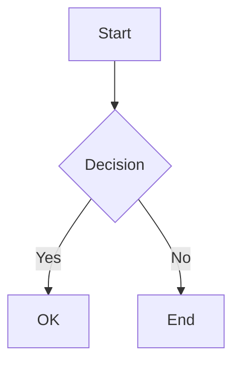

# Mermaid Formatting

This document explains how Mermaid diagram formatting was integrated into the Code Files plugin.

## Overview

Mermaid files (`.mmd`, `.mermaid`) opened in Monaco can now be formatted using `mermaid-formatter` via:
- **Shift+Alt+F** keyboard shortcut
- **Format Document** action in the context menu (F1 or right-click)
- **formatOnSave** option in Editor Config (formats automatically on Ctrl+S)

Additionally, **Mermaid code blocks inside markdown files** are automatically formatted when you format the markdown file. The formatter:
1. First applies Prettier to the markdown structure
2. Then formats all ` ```mermaid ` code blocks using `mermaid-formatter`

## Why mermaid-formatter?

Monaco Editor doesn't include a built-in Mermaid formatter. `mermaid-formatter` is a specialized formatter for Mermaid diagrams that provides consistent formatting for flowcharts, sequence diagrams, class diagrams, and other Mermaid diagram types.

## Implementation

### 1. Package Installation

```bash
yarn add mermaid-formatter
```

### 2. Bundle Entry Point (`src/mermaid-formatter-bundle-entry.js`)

Since `mermaid-formatter` is a Node.js package without a browser build, we create a wrapper:

```javascript
import { formatMermaid, formatMarkdownMermaidBlocks } from 'mermaid-formatter';
window.mermaidFormatter = { formatMermaid, formatMarkdownMermaidBlocks };
```

This exposes the formatter as a global `window.mermaidFormatter` object with two functions:
- `formatMermaid(code)` — formats standalone Mermaid code
- `formatMarkdownMermaidBlocks(markdown)` — formats all ` ```mermaid ` blocks in markdown

### 3. Build Step (`scripts/esbuild.config.ts`)

We bundle `mermaid-formatter` for the browser using esbuild and place it in the `formatters/` directory:

```typescript
const formattersTarget = path.join(buildPath, 'formatters');
await fs.promises.mkdir(formattersTarget, { recursive: true });

// Bundle mermaid-formatter for browser
await esbuild.build({
    entryPoints: [
        path.join(pluginDir, 'src/mermaid-formatter-bundle-entry.js')
    ],
    bundle: true,
    format: 'iife', // Wrap in (function(){...})() for <script> tag loading in the Monaco iframe
    outfile: path.join(formattersTarget, 'mermaid-formatter.js'),
    platform: 'browser',
    minify: isProd
});
```

This creates `formatters/mermaid-formatter.js` alongside Prettier files.

### 4. Script Loading (`src/editor/monacoEditor.html`)

The Mermaid formatter is loaded directly in the iframe HTML as a `<script>` tag:

```html
<!-- Step 2.5: load Prettier and Mermaid formatters -->
<script src="./formatters/prettier-standalone.js"></script>
<script src="./formatters/prettier-markdown.js"></script>
<!-- ... other Prettier plugins ... -->
<script src="./formatters/mermaid-formatter.js"></script>
```

The `./formatters/` path is resolved to an `app://` URL by the iframe's base URL patching in `mountCodeEditor.ts`.

The IIFE bundle exposes:
- `window.mermaidFormatter.formatMermaid` — formats standalone Mermaid code
- `window.mermaidFormatter.formatMarkdownMermaidBlocks` — formats Mermaid blocks in markdown

### 5. Formatter Registration (`src/editor/monacoEditor.html`)

We register two formatters:

#### A. Standalone Mermaid files (`.mmd`, `.mermaid`)

For standalone Mermaid files, we register a `DocumentFormattingEditProvider` for the `mermaid` language:

```javascript
monaco.languages.registerDocumentFormattingEditProvider('mermaid', {
    provideDocumentFormattingEdits: function(model) {
        try {
            if (!window.mermaidFormatter || !window.mermaidFormatter.formatMermaid) {
                console.warn('code-files: mermaid-formatter not loaded');
                return [];
            }
            var original = model.getValue();
            var formatted = window.mermaidFormatter.formatMermaid(original);
            if (formatted !== original) {
                lastFormatOriginal = original;
                lastFormatFormatted = formatted;
                window.parent.postMessage(
                    { type: 'format-diff-available', context: context },
                    '*'
                );
            }
            return [{ range: model.getFullModelRange(), text: formatted }];
        } catch(e) {
            console.warn('code-files: mermaid format failed', e);
            return [];
        }
    }
});
```

**Key points:**
- `formatMermaid()` is synchronous (unlike Prettier's async format)
- The function returns an array of text edits (Monaco's expected format)
- On error, we return an empty array (no formatting applied)
- Format diff tracking works the same as for Prettier formatters

#### B. Mermaid blocks inside Markdown files

For markdown files containing ` ```mermaid ` code blocks, we enhance the existing Prettier formatter:

```javascript
monaco.languages.registerDocumentFormattingEditProvider('markdown', {
    provideDocumentFormattingEdits: async function(model) {
        try {
            var original = model.getValue();
            var formatted = await prettier.format(original, {
                parser: 'markdown',
                plugins: [prettierPlugins.markdown],
                proseWrap: PRETTIER_PROSE_WRAP,
                printWidth: PRETTIER_PRINT_WIDTH,
                tabWidth: PRETTIER_TAB_WIDTH,
                useTabs: PRETTIER_USE_TABS
            });
            // Format mermaid blocks inside the markdown
            if (window.mermaidFormatter && window.mermaidFormatter.formatMarkdownMermaidBlocks) {
                formatted = window.mermaidFormatter.formatMarkdownMermaidBlocks(formatted);
            }
            return [{ range: model.getFullModelRange(), text: formatted }];
        } catch(e) {
            console.warn('code-files: prettier format failed', e);
            return [];
        }
    }
});
```

**Key points:**
- Prettier formats the markdown structure first
- Then `formatMarkdownMermaidBlocks()` processes all ` ```mermaid ` blocks
- This is a single-line addition to the existing Prettier formatter
- Works seamlessly with the existing diff viewer

### 6. Language Mapping (`src/utils/getLanguage.ts`)

We added Mermaid extensions to the language map:

```typescript
mmd: 'mermaid',
mermaid: 'mermaid',
```

This ensures `.mmd` and `.mermaid` files are recognized as Mermaid diagrams.

## Format Diff Viewer

After formatting a Mermaid file, you can view the changes:

- A **diff icon** appears in the tab header for 10 seconds
- Click it to open a side-by-side comparison (original vs formatted)
- The diff viewer is also available in the context menu: **"⟷ Show Format Diff"**
- Shows exactly what changed during the last format operation

## formatOnSave Integration

The existing `formatOnSave` logic works automatically for Mermaid files when enabled in Editor Config.

## Supported Diagram Types

`mermaid-formatter` supports all Mermaid diagram types:
- Flowcharts
- Sequence diagrams
- Class diagrams
- State diagrams
- Entity relationship diagrams
- Gantt charts
- Pie charts
- Git graphs
- And more

## Testing

To verify the integration:

### Test 1: Standalone Mermaid file

1. Create a `.mmd` file with unformatted Mermaid code
2. Open it in Monaco
3. Press **Shift+Alt+F** or right-click → **Format Document**
4. The diagram should be reformatted with consistent indentation and spacing

### Test 2: Mermaid blocks in Markdown

1. Create a `.md` file with a ` ```mermaid ` code block
2. Open it in Monaco
3. Press **Shift+Alt+F**
4. Both the markdown structure AND the mermaid block should be formatted

Example unformatted Mermaid:



After formatting:


## Dependencies

- **mermaid-formatter** (v0.3.0+) — installed via `yarn add mermaid-formatter`
- Bundled into `formatters/mermaid-formatter.js` at build time
- No additional dependencies in `main.js` — runs entirely in the iframe

## Future Enhancements

1. **Configurable Options:** Expose formatter options in Editor Config
2. **Format Selection:** Support formatting only selected text
3. **Error Reporting:** Show Mermaid syntax errors in Monaco's problems panel
