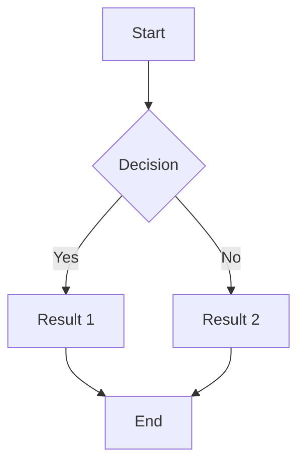
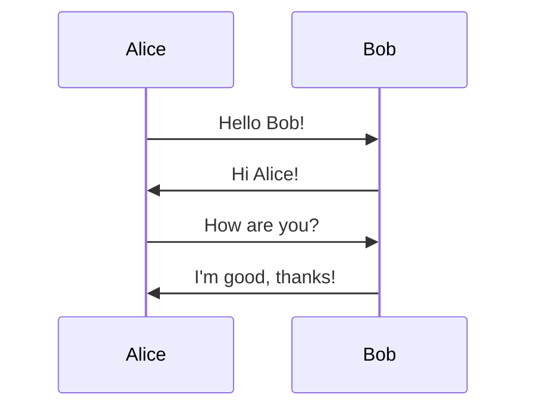

# Markdown Sample with Formatting Issues

This is a markdown file with   intentional    formatting errors to test   Prettier.

## Lists with bad formatting

- Item 1 with no proper spacing
-Item 2 missing space after dash
  - Nested item with inconsistent indentation
   - Another nested item
- Item 3

1. First ordered item
2.Second item missing space
3. Third item

## Code blocks

Inline code:`const x=5;` should have spaces.

```javascript
function test(){console.log("badly formatted");}
```

## Links and emphasis

This is **bold**and this is *italic*without proper spacing.

[Link](https://example.com)should have space after.

## Mermaid diagrams with formatting issues



Another mermaid diagram:



## Tables

|Column1|Column2|Column3|
|---|---|---|
|Data1|Data2|Data3|
|More data|Even more|Last column|

## Blockquotes

>This is a blockquote
>with multiple lines
>that should be formatted properly

## Horizontal rules

---

Text after rule.

***

More text.

## Final paragraph

This   paragraph    has    too    many    spaces   between   words and should be normalized by Prettier.
