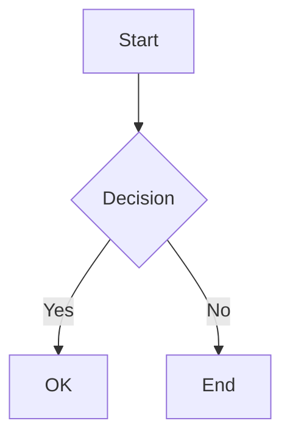
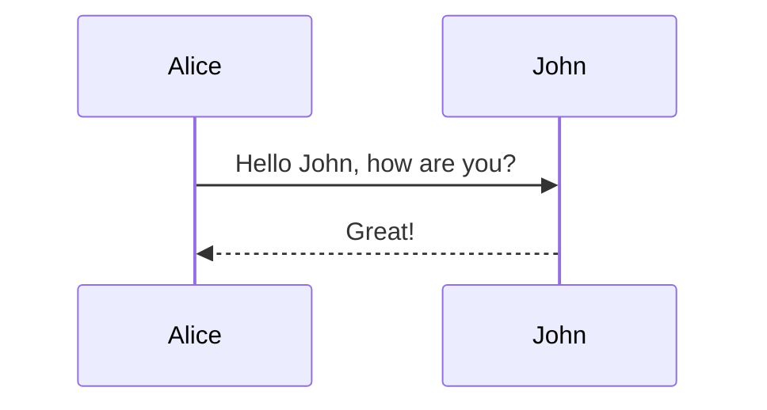

# Test Mermaid in Markdown

This is a test file with a mermaid diagram.

```mermaid
graph TD
A[Start]-->B{Decision}
B-->|Yes|C[OK]
B-->|No|D[End]
```

Some more text here.

```mermaid
sequenceDiagram
Alice->>John: Hello John, how are you?
John-->>Alice: Great!
```
